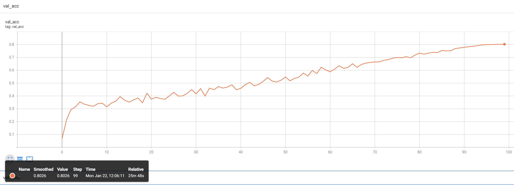
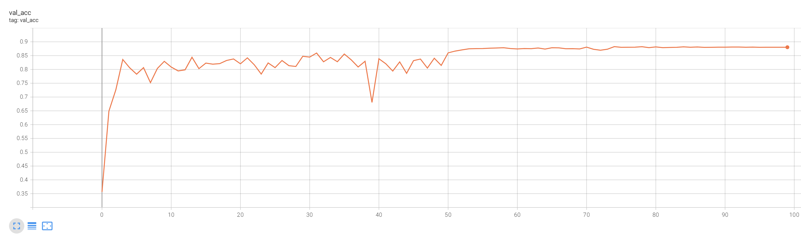
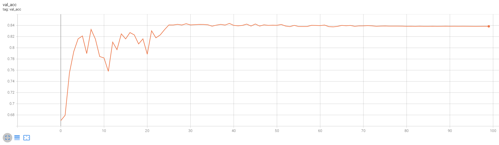

## Self-Prompt-Tuning: A PyTorch Implementation

This is a PyTorch implementation of the paper: `Revisiting the Power of Prompt for Visual Tuning`.

* The implementation mainly consists of three parts: `image preprocessing`, `loading of pretrained models`, and `training scripts`.

* The implementation also shows some training curves (tensorboard).

### 0. Environments

- PyTorch 1.10.0
- torchvision 0.11.0
- timm 0.6.0

### 1. Datasets and Pre-trained Model Preperation

- Dataset

    - See Table S1 in the Appendix for dataset details. 

    - Fine-Grained Visual Classification tasks (FGVC). The datasets can be downloaded following the official links.
      - [CUB200 2011](http://www.vision.caltech.edu/visipedia/CUB-200-2011.html)

      - [NABirds](http://info.allaboutbirds.org/nabirds/)

      - [Oxford Flowers](https://www.robots.ox.ac.uk/~vgg/data/flowers/)

      - [Stanford Dogs](http://vision.stanford.edu/aditya86/ImageNetDogs/main.html)

      - [Stanford Cars](https://ai.stanford.edu/~jkrause/cars/car_dataset.html)
    
    - Visual Task Adaptation Benchmark (VTAB-1K). Downloading these data sets is troublesome. It is recommended to refer to existing repo, such as VPT. We will release the splited training set, validation set and test set later to facilitate experimentation by others in the community.

    - The file folder `./Dataset` implements image reading and preprocessing for FGVC and VTAB-1K.

- Pre-trained Model

    - The following table provides the pre-trained checkpoints used in the paper.

        <table><tbody>
        <!-- START TABLE -->
        <!-- TABLE HEADER -->
        <th valign="bottom">Pre-trained Objective</th>
        <th valign="bottom">Link</th>
        <!-- TABLE BODY -->
        </tr>
        <td align="center">MAE</td>
        <td align="center"><a href="https://dl.fbaipublicfiles.com/mae/pretrain/mae_pretrain_vit_base.pth">download</a></td>
        </tr>
        <td align="center">MoCo v3</td>
        <td align="center"><a href="https://dl.fbaipublicfiles.com/moco-v3/vit-b-300ep/linear-vit-b-300ep.pth.tar">download</a></td>
        </tr>
        <td align="center">Supervised</td>
        <td align="center">timm</td>
        </tr>
        </tbody></table>
    
    - For supervised pre-training models, timm can avoid the trouble of weight format conversion (npz --> pth).

- Val-set curves and recipes

  - The task datasets, tuned model weights, some val-set accuracy curves, and train recipes in [link](https://pan.baidu.com/s/1Z4skq5RUc_insf4Ye2uYGg?pwd=ig33).


### 2. MAE Pre-training

  ```bash
  # for instance, transfer to CUB-200 via SPT-deep variant.
  torchrun --nproc_per_node=2 \
           train_MAE.py \
           --model_name MAE_vpt_deep_vit_b \
           --finetune ${PRETRAIN_CKPT} \
           --drop_path 0.0 \
           --dataset CUB200 \
           --tuning_type "prompt" \
           --num_prompts 20 \
           --prompt_deep \
           --prompt_sample_type "random" \
           --epochs 100 \
           --batch_size 32 \
           --weight_decay 1e-2 \
           --wd_head 0.5 \
           --lr 5e-2 \
           --min_lr 1e-8 \
           --warmup_epochs 10 \
           --model_ema \
           --save_dir ${SAVE_PATH}
  ```
  - `num_prompts` is 20 for deep, and 100 for shallow.

  - `prompt_sample_type` include 'kmeans', 'mean-pooling', 'max-pooling', and 'random'. For kmeans, the cluster center needs to be calculated in advance.

  - Turn off `prompt_deep` to implement the shallow variant.

  - The training scripts for other tasks are similar, please refer to `./script/MAE-IN1K`.


### 3. MoCo and Supervised Pre-training

  ```bash
  # for instance, transfer to dogs-120 via SPT-deep variant.
  torchrun --nproc_per_node=2 \
           train.py \
           --model_name vpt_deep_vit_b \
           --drop_path 0.0 \
           --dataset DOG120 \
           --tuning_type "prompt" \
           --num_prompts 20 \
           --prompt_deep \
           --prompt_sample_type "random" \
           --epochs 100 \
           --batch_size 32 \
           --weight_decay 1e-2 \
           --wd_head 3.0 \
           --lr 1e-3 \
           --min_lr 1e-8 \
           --warmup_epochs 10 \
           --model_ema \
           --save_dir ${SAVE_PATH}
  ```

  - The script is similar to MAE pre-training.

  - For supervised pre-trained model, we load the pre-trained weights by `timm`, e.g., `pretrain_model = timm.create_model('vit_base_patch16_224_in21k', pretrained=True)`

  - For other tasks, please refer to `./script/MoCo-IN1K` and `./script/sup-IN21K`.


### 4. some training curves

- We provide some training curves for reference. (MAE pre-training, ViT-B as backbone, plot the test accuracy curve.)

  - CUB-200
  <div style="text-align:center"></div>

  - Caltech101
  <div style="text-align:center"></div>

  - Patch_Camelyon
  <div style="text-align:center"></div>

- The accuracy fluctuates within a reasonable range. For example, we get 80.26, 80.39, 79.74 test accuracy when we fine-tuning MAE pre-trained ViT-B on CUB-200 three times with varying random seeds.


### 5. Citation
```BibTeX
@inproceedings{
    wang2024revisiting,
    title={Revisiting the Power of Prompt for Visual Tuning},
    author={Yuzhu Wang and Lechao Cheng and Chaowei Fang and Dingwen Zhang and Manni Duan and Meng Wang},
    booktitle={Forty-first International Conference on Machine Learning},
    year={2024},
}
```
